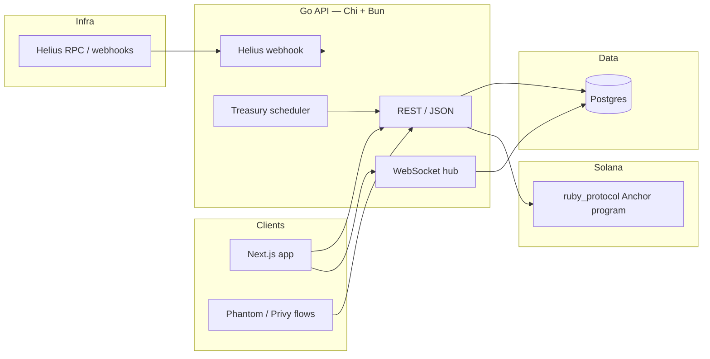

# Ruby

**Autonomous social savings on Solana** — savings circles with **on-chain rules**, **off-chain orchestration**, **real-time visibility**, and an **AI-ready treasury layer**. Built for **Dev3pack Hackathon 2026**.

> *“Ruby replaces spreadsheets and trusted admins with smart contracts and automation: every contribution is auditable, the vault is governed by code, and idle funds can be routed toward yield — transparently.”*

---

## Why judges should care

| Lens | What Ruby demonstrates |
|------|-------------------------|
| **Problem** | Informal savings circles rely on trust, manual tracking, and opaque pools of cash. |
| **Solution** | **Programmable group vaults** (Anchor), **verifiable activity** (chain + indexed events), **API + WebSocket UX**, and **treasury automation hooks** for yield and cycles. |
| **Depth** | Full **three-tier stack**: Rust smart contracts, production-style **Go API** with Postgres, modern **Next.js** client patterns (`@solana/react-hooks`). |
| **Ship discipline** | **CI on `main`**, integration tests, **idempotent DB migrations** at boot, **readiness** probe that pings Postgres. |

---

## Live demo

| Surface | URL / notes |
|---------|-------------|
| **Backend (production)** | `https://ruby-api-vfwf.onrender.com` |
| Health | `GET /health` — process up |
| Readiness | `GET /health/ready` — Postgres reachable |
| Realtime | `GET /api/v1/ws` — WebSocket event stream |

Configure the frontend `NEXT_PUBLIC_*` API base URL to point at this host for end-to-end demos.

---

## Architecture



**Execution model:** Canonical state transitions are defined **on-chain** (`contracts/`). The backend maintains a **fast mirror** in Postgres for queries, cycles, credit scoring, and realtime fan-out — matching how serious Solana products combine chain truth with off-chain UX.

---

## Repository map

| Path | Role |
|------|------|
| [`contracts/`](contracts/) | **Anchor** program `ruby_protocol` — groups, members, contributions, SWIG proposals, loans, blinks, yield events. |
| [`backend/`](backend/) | **Go** HTTP API, auth (Privy + Phantom challenge), Web3 tx planning, Helius ingestion, treasury agent scheduler, WebSockets. |
| [`frontend/`](frontend/) | **Next.js 16** + **Tailwind 4** + **`@solana/react-hooks`** — wallet-forward UI shell. |
| [`docker-compose.yml`](docker-compose.yml) | Local **Postgres 16** for development. |
| [`.github/workflows/backend-ci.yml`](.github/workflows/backend-ci.yml) | **Go tests** with Postgres service container on every push/PR touching `backend/`. |

---

## Feature highlights (hackathon story)

Aligned with the **Project Ruby — Full Technical Roadmap** (phased delivery: foundation → vaults → treasury → interface → blinks):

1. **Groups & vault semantics** — Create/join/contribute flows backed by `ruby_protocol` and mirrored in the API.
2. **Governance-shaped primitives** — SWIG-style proposals/approvals, loan requests and votes, Token-2022 configuration hooks.
3. **Treasury & cycles** — Scheduled agent runs, cycle endpoints, settlement-oriented tables, **credit score** API driven by contribution discipline vs deadlines.
4. **Realtime** — WebSocket hub with group-scoped broadcasting so dashboards feel alive during demos.
5. **Observability** — Helius webhook path applies chain-side activity into Postgres for a coherent **explorer-grade** narrative.

---

## Tech stack (as shipped)

| Layer | Choice |
|-------|--------|
| Smart contracts | **Anchor** (Rust), Solana **devnet → mainnet** path |
| API | **Go 1.22**, **Chi**, **Bun** ORM |
| Database | **PostgreSQL** (Render / Docker locally) — migrations via `EnsureSchema` + `migrate` CLI |
| Frontend | **Next.js**, **TypeScript**, **Tailwind**, **`@solana/client` / `@solana/react-hooks`** |
| Indexing / alerts | **Helius** webhook + RPC |
| Auth | **Privy** JWT verification + **Phantom** signed-message flow |

Roadmap docs also mention Swig programmable wallets, SendAI, Vercel, Supabase — this repo intentionally standardizes on **Postgres + Render + GitHub Actions** for a **clear, judge-friendly** deployment story without sacrificing architectural ambition.

---

## Quick start (local)

### 1. Database

```bash
docker compose up -d
```

### 2. Backend

```bash
cd backend
cp .env.example .env   # set DATABASE_URL, RPC, secrets as needed
make run               # or: go run .
```

- `GET http://localhost:8080/health`
- `GET http://localhost:8080/health/ready` (needs valid `DATABASE_URL`)

### 3. Smart contracts

```bash
cd contracts
pnpm install
anchor build
anchor test
```

### 4. Frontend

```bash
cd frontend
npm install
npm run dev
```

Deep dives: [`backend/README.md`](backend/README.md), [`contracts/README.md`](contracts/README.md), [`frontend/README.md`](frontend/README.md).

---

## Operations & trust

- **Migrations** run automatically when the API starts (`db.Open`). Fail-fast: bad DDL **blocks** serving traffic.
- **Manual migrate:** `./ruby-server migrate` from the backend binary (same as Render).
- **Judges:** Ask for a live transfer or webhook payload trace — Helius → API → DB → WebSocket tells a complete story.

---

## Vision (one slide for pitch decks)

Ruby turns **rotating savings** and **group treasuries** into **open, programmable infrastructure**: contributors keep autonomy and transparency, groups gain **shared enforcement**, and capital can **compound** instead of sitting idle — with **every step attributable** on Solana.

---

## License & team

Project maintained by **Dev3pack / Kioko542** for hackathon delivery. See repository history for contributors.

**Ruby — save together, prove it on-chain.**
